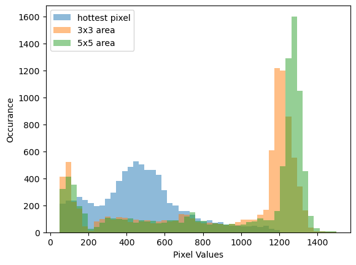

# Development

The worker and reducer may be developed locally by replaying ingester recorded streams.

Provide the classes for the worker and reducer as well as the ingester files.
Optionally parameters may be provided in json or pickle format.

   dranspose replay -w "src.worker:FluorescenceWorker" -r "src.reducer:FluorescenceReducer" -f ../contrast_ingest.pkls ../xspress_ingest.pkls -p ../params.json

# Femtomax Analysis Modes

Femtomax requires very different tools compared to continuous beamlines.
A ciritcal feature is the accumulation of long scans to see something at all.

Here is an overview of the analyses currently implemented

## Wide Angle Diffraction with Pilatus

With the Pilatus mounted on the sample vacuum chamber it detects nearly 180° of diffraction rings.
The photon counting already provides noise free data, however a single linac pulse barely produces enough photons to observe a meaningful diffraction pattern in a single exposure.

### Cluster Analysis
To get a meaningful diffraction pattern, Pilatus images need to be added on top of each other.
The start and stop of an accumulation is set manually and often used in Continuous mode without a scan.
This accumulation must work across scans as it is necessary to accumulate more data if the signal is too weak at the end of a scan.

### Live Viewing
The accumulated image is displayed with a total number of frames which contributed to it.
If the position of the detector and the photon energy is set, the live viewer draws curves at given q values onto the image.

### Future Work
It the live viewer sets the geometry of the detector, the pipeline uses these to write a poni file and in addition to the accumulated image also calculates the azimuthal integration of this image.

## Bragg Peak Analysis

The x-ray Zyla is used to monitor the position or intensity of a bragg peak.
Sometimes, the Pilatus is used to measure the same, so the analysis has to work with CMOS and photon counting data.

### Cluster Analysis
For CMOS data, there exists a background noise which needs to be subtracted by using a dark frame.
Fortunately, every pixel fluctuates normally distributed with a mean of 100, which allows us to use a uniform 100 value as dark frame.
After background subtraction, we apply a threshold (default 12 for the Zyla) and only use pixels with a value above the threshold.

On this final image, or the direct image from the Pilatus, we take the mean value for multiple rectangulat ROIs.
These means are then exposed over time or if available the scan motor.

If the signal is very weak, the finale image needs to be accumulated.

### Live Viewing

The accumulated image is shown with the ability to draw ROIs.
If ROIs are set, the time/motor positoin dependent scalar means are shown in a default live viewer.

## Single Photon Detection on Balor

For some experiments, the photon yield is so low, that each individual hit which spreads over multiple pixels due to charge sharing.

An example of a dark corrected single hit with pixels above a specified threshold:

Using the single hottest pixel is not enough, as there are spurious hot pixels in the exposures.

Therefore, we first find blobs around pixels over the threshold and merge them based on if they share the hottest pixel.
The total sum of the 3x3 pixel area around the hottest pixel yield a specific peak with a mean of 1200.

If we define a cutoff at 1100, we can select all blobs with actual photon hits.
An important metric is that there exist no blobs with values above 1400.
This assures us that no two photons hit close to each other in the same 3x3 grid.

If trusted, we perform a direct data reduction and only store the total intensity of the 3x3 grid and the center of gravity within as y,x float coordinates.

The analysis for the Zyla is way tricker as the signal is way closer to the noise level.

### Cluster Analysis

The analysis is restricted to a ROI as it is quite computationally expensive.
And this analysis only works if the photons are sparse. We need to subtract a background, then apply a threshold to find potential hit areas.
If the hit pixel density is low enough, we perform the blob unification and thresholding with data reduction.
The pipeline writes a x,y,energy h5 file in the process folder.
If trusted, the Balor has an attribute: SaveRaw which can disable the raw saving.

As a live output, we reconstruct a "clean" image from the xy coordinates and a special view threshold (e.g. 1100).
The clean image is 0 ouside of the analysis ROI.

This analysis may happen as a pre-step to the above methods, i.e. there is a ROI, aggregation or azint step based on the "clean" image.

### Live Viewing

The live viewer should display the clean image as well as an energy histogram to quickly assess that the density is not exceeding the single blob hypothesis and 2 photons hit close by.

# Cluster Analysis Pipeline

The dranspose pipeline has the following streams

- **sardana**: provides the `ref_movables` motor positions at every step.
- **pilatus**: provides STINS images of float type as the TOT conversion is already applied.
- **andor3_zyla10**: is the xray zyla which is used for peak analysis.
- **andor3_balor**: is the STINS balor image stream.

## Sardana
If sardana is present, we expose the `ref_movables` positions as `x` axis for potential plots
If absent, the `x` axis is just the frame number.

## Balor

If the balor is present, it performs photon detection if:
- an initial threshold is set (default 110)
- an energy threshold is set (default 800)
- a ROI is set to limit the analysis area

From the header of the stream, we extract the filename to use as the process filename for the xye data.

It reconstructs a "clean" image for further use with the same shape as the input.

If the balor gets too many photons, it performs the same background subtraction as the Zyla 10, described below.

## Zyla 10
As single photon detection is hard with the zyla, we only perform this in post-processing.

To still accumulate images, we subtract the background value and apply a threshold. Every pixel below the threshold is set to 0.

The output is of the same shape as the input.

## Accumulation

The image of either a processed cmos image or directly the Pilatus is then fed into an accumulation.
If the accumulate property is true, it accumulates, otherwise it forwards the incoming image.
On a change of shape, the accumulation is reset.

As metadata, the image should expose the pixel size to distinguish the CMOS from the Pilatus and correctly draw q curves.

## ROI Means
Parallel to the accumulation, for every specified ROI, the mean is calculated and published matching the `x` axis from sardana.

# Live Viewer

The main live viewer will be based on the existing one which supports entry of detector position on the left and multiple ROIs on the right.
The center displays the full image, optionally zoomed in to save transfer bandwidth.

As iteractions it allows:
- start/stop accumulation
- add/delete/change ROIs
- set detector position
- Enable a max filter which enhances small single pixels which otherwise would disappear while rendering.

The viewer without any rois supports plotting q curves, here with a LaB6 sample.

    ModuleViewer -c DrpViewer http://femtomax-pipeline-reducer.daq.maxiv.lu.se

To access the ROI over time or motor position with error bars of the standard deviation per step, run

    HsdsViewer http://femtomax-pipeline-reducer.daq.maxiv.lu.se/ "/step_means/ROI 2"

